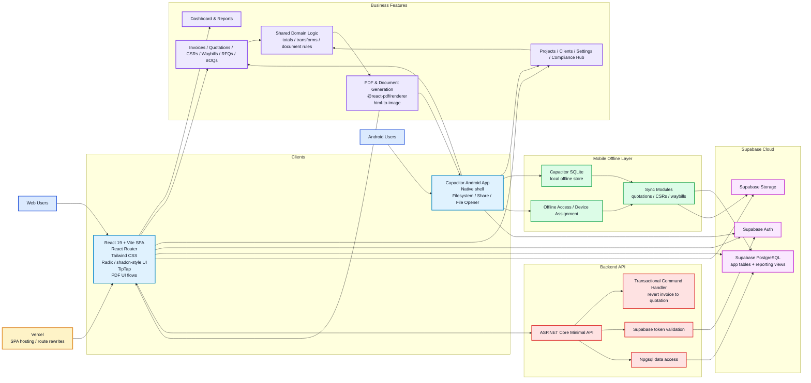

# BigDrops Architecture Diagram

This file uses Mermaid so GitHub can render it directly in a repository README or standalone Markdown file.

## Notes
- Main platform shape: React/Vite frontend + Capacitor Android app + Supabase backend + small ASP.NET Core API.
- The frontend talks mostly directly to Supabase for auth, database access, and storage.
- The Android app adds offline SQLite storage and sync modules.
- The .NET API handles selected transactional server-side operations.
