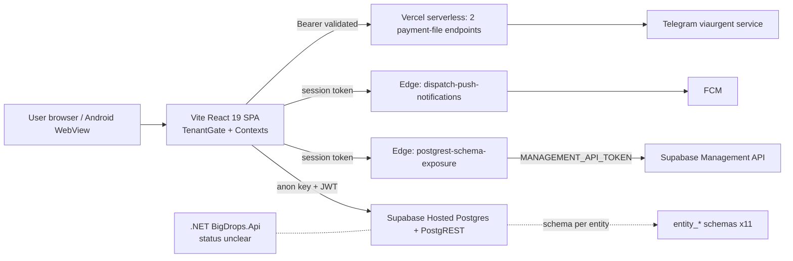

# Forensic Application and Delivery System Audit — BIGDROPS

This report was written by Muse Spark on 2026-09-09 via OpenCode (read-only audit, no code changed).

- Objective: Execute `docs/prompts/Forensic-audit-prompt.md` and deliver an evidence-locked audit.
- Scope: Full repository, delivery system, and live hosted-database posture (read-only probes).
- Files changed: NONE.
- Skills used: supabase, supabase-postgres-best-practices, typescript-advanced-types, react-dev, react-useeffect, karpathy.
- Documentation standard: ASD-STE100 Simplified Technical English.
- Verification result: `bun run audit:load` passed with warnings; `bun run test` 269 pass / 4 fail (pre-existing env failures); `git status` shows only concurrent-agent work, none from this audit.
- Risks or limitations: No production credentials used. No load test ran. Findings cite code, not runtime behavior, unless live probes state otherwise.
- Deferred work: Load testing, dependency vulnerability scan (no network), device-matrix testing.

---

## DISCOVERY LOG — FORENSIC INVENTORY

### 1. Repo Topology and Key Surfaces

| Area | Evidence | Fact |
|---|---|---|
| App root | `package.json:1-15`, `vite.config.js:1-21`, `index.html` | Vite 7 + React 19 SPA, Bun runtime, TypeScript 5.9 |
| UI code | `src/components` 423 files, `src/domain` 141, `src/pages` 92, `src/lib` 70, `src/modules` 69, `src/hooks` 31 | Large monolith SPA, domain logic separated from UI |
| Backend | `supabase/migrations` 100 SQL files; `supabase/functions` 2 edge functions | Supabase Postgres + Deno edge functions |
| Parallel backend | `backend/BigDrops.Api/Program.cs:1-40` | Real .NET API (rate limiting, compression), Sentry TODO |
| Serverless | `api/upload-payment-attachment.ts:34`, `api/edit-payment-caption.ts:18` | 2 Vercel functions, Bearer-token validated |
| Native shell | `capacitor.config.ts:5-22`, `android/` 19 entries, `package.json:17-28` | Capacitor 8 Android app (`com.bigdrops.app`) |
| PWA | `public/` holds only `vite.svg`; no manifest, no service worker | No PWA. Web has no offline mode |
| Native offline | `src/lib/native/offlineAccess.ts:17,49,93` | 48-hour native offline window only |
| Docs corpus | `docs/**/*.md` 997 files; `docs/standard/` 15 standards | Heavy documentation footprint |

### 2. Tech Stack Matrix

| Layer | Technology | Evidence |
|---|---|---|
| Frontend | React 19.2, react-router-dom 7, Tailwind 3.4, shadcn/radix | `package.json:83-89`, `package.json:110` |
| State | React Context (Workspace, Entity, Authorization, Operation, DocumentQuery, Theme) | `src/lib/tenant/contexts.tsx:64,272,507`, `src/context/` |
| Data | Supabase JS 2.112, RLS, SECURITY DEFINER RPCs (193 public functions) | `package.json:62`, migration grep counts |
| PDFs | @react-pdf/renderer 4, takumi-pdf, @formepdf, pdf-lib | `package.json:53,60,81,91` |
| Mobile | Capacitor 8, Capgo biometric, SQLite, FileOpener | `package.json:17-28,69` |
| Validation | zod 4, decimal.js (money math) | `package.json:73,93` |
| Rich text | TipTap 3, DOMPurify 3.3 | `package.json:64-68,74` |
| CI | GitHub Actions (APK dispatch + docs lint only) | `.github/workflows/` 2 files |
| Hosting | Vercel (SPA fallback), Supabase hosted (ref `xqlpekpkbszpdgtuwybh`) | `Vercel.json:1-16`, `supabase/database-workflow.md` |
| Lockfile | `bun.lock` present, Bun-only policy | `package.json`, `AGENTS.md` |

### 3. Routes, APIs, Contracts, Schemas

- Web routes: 54 `<Route>` declarations. Entry: `src/App.tsx:569` (`/reset-password`), `src/App.tsx:571` (`/*` gate switch). App routes: `src/components/app/AppShell.tsx:275-330` (dashboard, invoices, quotations, CSR, clients, settings, accounting, projects, reports, compliance, item library, waybills, RFQs, BOQs, receipts, letters, `/debug/tenant`, localhost-only `/debug/errors`).
- Tenant gate: `src/components/app/TenantGate.tsx:39` → `resolveGatePhase()` in `src/domain/tenant/tenantGate.ts:180`.
- Edge functions: `postgrest-schema-exposure` (MANAGEMENT_API_TOKEN, PROJECT_REF) and `dispatch-push-notifications` (FCM_SERVER_KEY), both Deno (`Deno.serve`), `supabase/config.toml` sets `deno_version=2`.
- DB contracts: 100 migrations; 193 `CREATE OR REPLACE FUNCTION public`; 158 `CREATE POLICY`; 57 RLS enables. Key RPCs: `provision_entity` (latest `20260906103000_source_transactions.sql:514`), `is_tenant_schema_exposed` (`20260905200145_exposure_probe_queue_state.sql:28`), `claim_pending_pgrst_schemas` (`20260903120000_pgrst_queue_row_locking.sql:21`), `_prov_seed_default_permissions` (canonical `20260909025241_restore_canonical_permission_seed_v2.sql:42`).
- Live posture (read-only probe 2026-09-09): 11 entities, 11 tenant schemas, 0 pending exposure rows, 4 workspace memberships.
- API cap: `[api] max_rows=1000`, exposed schemas `public,graphql_public` in `supabase/config.toml`.

### 4. Cloud and Hosting Signals

| Signal | Evidence | Meaning |
|---|---|---|
| Vercel SPA | `Vercel.json:6-15` | `/api/*` to functions, all else to `index.html`. `git.deploymentEnabled=false` |
| Security headers | `Vercel.json` has no `headers` stanza | No HSTS, CSP, X-Frame-Options in repo |
| Docker/K8s/Terraform | All globs 0 hits | Fully managed hosting, no IaC |
| Supabase local | `supabase/config.toml` exists; `site_url=http://127.0.0.1:3000` | Local default; hosted project is authoritative |
| Regions/DR | No evidence in repo | [ASSUMPTION – VALIDATE]: Supabase/Vercel defaults apply |

### 5. DevOps and Observability Signals

- Workflows: `build-android-debug.yml` (manual dispatch: Bun install, build, Gradle APK, 30-day artifact); `docs-commit.yml` (docs-only: commit-lint + secret-pattern grep). No PR gate runs typecheck or tests.
- Hooks: `.githooks/pre-push` only. No CODEOWNERS, SECURITY.md, CONTRIBUTING.md.
- Observability: Sentry import commented out (`src/main.tsx:30-41`); .NET Sentry TODO (`Program.cs:15-19`). Logging is ad-hoc `console.*`. No health endpoint. No APM/RUM.

### 6. Testing and Quality Signals

- Runner: `node:test` + assert via `package.json:9`; 90 test files under `src/tests` (critical ~28, invoice ~18, pdf ~9, item-library 8, others smaller). No vitest/jest. No e2e (no Playwright/Cypress).
- Fresh result 2026-09-09: 269 pass, 4 fail. All 4 fail at file load (`:1:1`) on `import.meta.env` outside Vite (`invoiceAccountingIntegration`, `paymentAccountingIntegration`, `remediationContract`, `sourceTransactionContract`). Pre-existing, unrelated to tenants.
- Load guard: `scripts/check-load-risk.cjs` (`audit:load`) reports Files 791, Broad Selects 6, Component Fetches 1, Heavy Limits 3.

### 7. Docs and Comment Evidence

- 997 markdown files under `docs/`. Normative standards: `docs/standard/` (15 files). PRD authority: `docs/prd/multi-tenancy/Readme.md` (v2.1 single source of truth). Skill index: `docs/PROJECTSKILLINDEX.md` (110 skills). Agent rules: `AGENTS.md`, `CLAUDE.md`.
- Debt signal: `docs/reports/architecture/tech-debt-drift-audit-2026-09-08.md` exists; working tree shows concurrent-agent churn (staged deletions of `dev/null`, `tsconfig.tsbuildinfo`, debris SQL).

---

## A — EXECUTIVE FORENSIC SNAPSHOT

### A1. Platform Reality Today

| Capability | State | Evidence |
|---|---|---|
| Multi-tenant ERP (workspace → entity → schema) | Full | Live: 11/11 schemas; gate `TenantGate.tsx:39`; RLS 158 policies |
| Invoice/quotation/CSR/waybill/receipt/letter lifecycle | Full | `src/pages` View/New/Edit triads; `src/domain/{invoice,quotation,csr,waybill}` |
| BOQ/RFQ, projects, clients, item library | Full | Routes `AppShell.tsx:295-330`; domain dirs |
| Double-entry accounting kernel + reporting | Partial | 4 critical suites red at load; `20260906140000` migration broken (`v_source_id` undeclared) blocks `db push` |
| Compliance hub, reports | Full UI | `ComplianceHub`, `Reports` routes; PDF POC reports in tree |
| Push notifications | Partial | Edge function exists; FCM key server-side; no client registration evidence found |
| Android app | Partial | Native shell + offline libs exist; no device-matrix test evidence |
| PWA / web offline | Missing | No manifest, no service worker |
| Observability | Missing | No active tracker, no health endpoint |
| Web3 | N/A | No contracts, no deps; only config stanza + skill docs |

### A2. Critical Gaps

1. Production blindness (no error tracking). 2. Security headers absent. 3. CI gates nothing on PRs. 4. Migration pipeline blocked by broken accounting migration. 5. Dual-backend ambiguity (.NET API vs Supabase). 6. No e2e coverage. 7. Working-tree churn across agents.

### A3. Readiness Verdicts

| Target | Verdict | Rationale |
|---|---|---|
| UAT | 🟡 YELLOW | App works end-to-end on happy paths (tenancy verified live), but 4 red suites and no e2e reduce confidence |
| Production | 🔴 RED | Blockers E-P0-01 (blind ops), E-P0-02 (headers), E-P0-03 (migration pipeline blocked) |
| Mobile | 🟡 YELLOW | Shell + offline libs exist; no device-matrix evidence, no push E2E proof, no store-readiness artifacts |

Top blockers condensed (full register in section E): P0 — ops blindness; security headers; blocked migration push; PR-gate absence. P1 — .NET/Supabase authority ambiguity; SSR XSS fallback; verbose serverless logs; tracked build artifacts (`dist-test/`); no PWA strategy decision; docs sprawl.

---

## B — AS-IS ARCHITECTURE AND TOPOLOGY

### B1. System Topology

### B2. Cloud and Hosting Model

Fully managed: Vercel static + serverless, Supabase hosted Postgres/Auth/Edge. No containers, no IaC, no region config in repo. Environment parity risk: `config.toml` points at localhost; hosted truth lives in dashboard/Management API.

### B3. Networking and Security Perimeter

TLS via platforms (inherited, no config evidence). No WAF, rate-limit, HSTS, CSP, or frame policy in repo. .NET API has server-side rate limiting (`Program.cs:36-40`) but its deployment status is unknown. Supabase Auth: no anonymous sign-ins (`config.toml`), JWT-gated RLS throughout.

### B4. Front-End Architecture

React 19 + React Router 7 (declarative `<Routes>`, no data router), Context-based state (6 providers), Tailwind + shadcn/radix UI. A11y: 98 `aria-*` hits, landmarks used, `focus-visible` pervasive; gaps: no skip links, touch-target audit absent, no reduced-motion evidence. Perf: audit guardrails exist (`audit:load`); largest files `themePresets.ts:1293`, `database.types.ts:1188`, `CsrFormScreen.tsx:996` (complexity hotspots).

### B5. Back-End Architecture

Postgres-as-backend: 193 public RPCs, SECURITY DEFINER with in-body `auth.uid()` checks (correct pattern per skill checklist). Provisioning is transactional DDL + advisory locks; exposure is durable-queue + Edge + Management API with claim/release concurrency control. Vercel functions validate Bearer via `auth.getUser` (`upload-payment-attachment.ts:57-61`). .NET API duplicates at least invoice-revert logic — authority unclear [ASSUMPTION – VALIDATE].

### B6. Database and Data Management

Schema-per-entity tenancy, RLS deny-by-default with `has_entity_permission` wildcard model. Migration discipline: 100 files, CLI-managed; currently blocked by broken `20260906140000` (push aborts, verified prior session). Live: 11 entities ↔ 11 schemas, 0 queue backlog. PITR/backup: no repo evidence [ASSUMPTION – VALIDATE against Supabase plan].

### B7. Integration and Middleware

Outbound: FCM (push), Telegram (payment attachments via `telegramService`), Supabase Management API (exposure). No broker, no webhooks-in, no circuit breakers in repo. Client resilience: fetch timeout 20s + one retry for idempotent GETs (`src/supabase.ts:8,81-122`).

### B8. Web3 Layer

Not applicable. No contracts, no chain deps, no wallet code. (Only `config.toml` auth rate-limit stanza and skill-doc mentions.)

### B9. DevOps, SRE, Delivery Posture

CI builds APK on manual dispatch and lints docs commits. No test/typecheck gate, no preview-per-PR evidence, no canary, no secrets manager (env-based; `.env` untracked — good). Concurrent-agent working tree shows staged/unstaged churn with no CODEOWNERS protection.

### B10. Scalability, Resilience, DR, Sustainability

PostgREST `max_rows=1000` requires pagination discipline (flagged Broad Selects: 6). No autoscale/DR/RPO/RTO evidence (platform-inherited). Sustainability: ~20 font packages + dual animation libs (`framer-motion` + `motion`) + dual PDF stacks inflate bundle — measure, then prune.

---

## C — CAPABILITY AND FEATURE FORENSICS

### C1. Capability Hierarchy (L1 → L2 → L3)

- L1 Tenancy & Identity: L2 workspace lifecycle → L3 create/approve/invite/transfer/archive; L2 entity lifecycle → L3 provision/expose/permissions/purge; L2 auth → L3 login/reset/biometric(Android).
- L1 Sell: L2 invoice → L3 create/edit/clone/void/record-payment/PDF; L2 quotation → L3 same + convert; L2 CSR → L3 form/sign/offline.
- L1 Move: L2 waybill → L3 reserve-number/download/dispatch; L2 receipt/letter.
- L1 Build: L2 BOQ/RFQ → L3 rows/items/vendor compare; L2 projects → L3 documents/linking.
- L1 Count: L2 accounting kernel → L3 post/reverse/periods/journals/reports (PARTIAL — red suites); L2 compliance/tax → L3 filings/reminders/WHT/VAT inputs.
- L1 Run: L2 clients/item-library → L3 CRUD/import/cleanup; L2 dashboard/reports; L2 notifications/push (PARTIAL); L2 settings/admin.

### C2. Exhaustive Feature Matrix (condensed; states verified by code presence + tests + live probes)

| L1 | L2/L3 | Evidence | State | Security | Test cover | Gap / Effort |
|---|---|---|---|---|---|---|
| Tenancy | Provision → expose → gate | `tenantGate.ts:180`, `contexts.tsx:272`, live 11/11 | Full | RLS+probe, fail-closed | 25 gate/bootstrap tests pass | None (S) |
| Sell | Invoice CRUD + PDF | `Invoices.tsx`, `invoicePdfActions` | Full | entity_permissions | invoice ~18 tests | None (S) |
| Sell | Quotation convert | quotation domain (7 files) | Full | same | covered | None (S) |
| Move | Waybill reserve/download | `WaybillFormPage.tsx:85-143` | Full | waybill grant via wildcard | covered | None (S) |
| Build | BOQ/RFQ/projects | `Boqs.tsx`, `Rfqs.tsx`, `Projects.tsx` | Full | same | covered | None (S) |
| Count | Accounting post/reverse | kernel tests red at load | Partial | RLS present | 4 suites BROKEN | Fix env/imports (M) P1 |
| Count | Reporting foundation | `20260908100000` staged, test staged | Partial | read-only RPC design | staged test | Land migration (M) P1 |
| Run | Push notify | edge fn only | Partial | FCM key server-side | none found | Client wiring (M) P2 |
| Run | Android offline 48h | `offlineAccess.ts:17` | Partial | device assignment RPCs | none found | Matrix tests (L) P2 |
| Platform | PWA | absent | Missing | n/a | n/a | Decision + build (XL) P3 |

### C3. Traceability Matrix (sample)

| Requirement (implied) | Evidence chain |
|---|---|
| Tenant isolation | `provision_entity` (:514) → per-schema RLS → `is_tenant_schema_exposed` (:28) → gate `TenantGate.tsx:75-121` → live 11/11 |
| No usable-before-exposed | `waitForTenantExposure` (`tenantCreation.ts`) + gate `schemaExposed` (`tenantGate.ts`) + edge verify-after-PATCH |
| Canonical permissions | seeder v2 migration `:42` → live Adel 58/4 = Anthropology 58/4 |
| Fail-closed data access | `tenantClient.ts:12-24` throws on null schema; probe fails closed (`20260905200145:85-88`) |
| Money integrity | `src/lib/Calculations.ts:694` single entry; kernel tests (currently red at load) |

---

## D — JOURNEY, UX, AND MOBILE FORENSICS

### D1. Route and Entry Map

Web entries: `/` (gate), `/reset-password`, 52 app routes (`AppShell.tsx:275-330`). Debug: `/debug/tenant`, localhost-only `/debug/errors`. Deep links: Capacitor custom scheme config present; universal-link asset evidence not found. No PWA entry (no manifest/SW).

### D2. Persona Journey Dissections

- Owner onboarding: Login → workspace create → approval wait → auto first-company (`ensureInitialCompany`) → provisioning hold → exposure hold → usable. Failure modes covered: `ProvisioningFailed`, `WorkspacePendingApproval`, invitation accept/pass.
- Staff join: invite email → accept (`accept_workspace_invitation`) → role assignment post-acceptance → entity-scoped grants.
- Document flow: list → create/edit (validation) → save (offline queue where supported: quotation/CSR native) → PDF/download/share.
- Offline: native 48h window then `OfflineAccessBlocked`; web has no offline path (gap).

### D3. UAT and Mobile Blocking Punchlist

- [x] Responsive layout (mobile-first sheets, drawers)
- [x] Landmarks + labels on key flows (98 aria hits)
- [ ] Skip-link / screen-reader pass (no evidence)
- [ ] Touch-target audit (no evidence)
- [ ] Web offline (missing by design — needs decision)
- [ ] Android device matrix (no evidence)
- [ ] Push end-to-end (no evidence)
- [ ] Store assets/listing (no evidence)

---

## E — FINDINGS REGISTER

| ID | Category | Sev | Blast radius | Evidence | Description + repro/inspection |
|---|---|---|---|---|---|
| E-P0-01 | Observability | P0 | All prod users | `src/main.tsx:30-41`, `Program.cs:15-19` | No active error tracking anywhere. Inspect: open file, Sentry commented out. Fix: enable Sentry (or equivalent) web + edge + .NET. Accept: real error visible in dashboard. Tests: synthetic error E2E |
| E-P0-02 | Security headers | P0 | All web users | `Vercel.json:1-16` (no headers) | No HSTS/CSP/frame policy. Inspect: `curl -sI` prod URL. Fix: add headers stanza. Accept: headers present, no console breakage |
| E-P0-03 | Delivery blocked | P0 | All DB changes | `20260906140000_accounting_remediation.sql` (`v_source_id` undeclared) + `supabase db push` abort | Broken migration blocks every later migration incl. permission-seed history. Fix: owner repairs declaration. Accept: `migration list` shows applied |
| E-P0-04 | CI gates | P0 | Every PR | `.github/workflows/` (2 files, neither runs tests) | Type/test failures mergeable. Fix: add typecheck+test job on PR. Accept: red PR blocked |
| E-P1-01 | Arch ambiguity | P1 | Invoices | `backend/BigDrops.Api/` vs Supabase RPCs | Two backends overlap (revert-invoice). Inspect: `Program.cs`, `Endpoints/`. Fix: declare authority, archive or wire the other. Accept: ADR + one path |
| E-P1-02 | XSS hardening | P1 | Rich-text surfaces | `src/lib/richText.tsx:10-14` | SSR/no-window path returns unsanitized HTML. Fix: sanitize unconditionally or never render that path. Accept: unit test both branches |
| E-P1-03 | Log hygiene | P1 | Serverless | `api/upload-payment-attachment.ts:35-62` | Verbose debug logs user email + config presence. Fix: remove TAG logs / redact. Accept: grep clean |
| E-P1-04 | Repo hygiene | P1 | All devs | `git ls-files` shows `dist-test/`, staged deletions, live `.env` untracked-ok | Build artifacts tracked; churn across agents. Fix: untrack `dist*/`, CODEOWNERS, branch rules. Accept: clean `git status` policy doc |
| E-P1-05 | Accounting tests red | P1 | Ledger trust | 4 suites fail at `:1:1` on `import.meta.env` | Test env lacks Vite shim. Fix: setup-file define or dynamic import guard. Accept: 273/273 green |
| E-P2-01 | PWA decision | P2 | Web mobile | `public/vite.svg` only; `vite.config.js:1-21` | No offline web story. Fix: decide PWA vs native-only, document. Accept: ADR |
| E-P2-02 | Bundle weight | P2 | Load perf | `package.json` (~20 fontsource, motion×2, PDF×4) | Fix: audit:load budget + prune. Accept: budget in CI |
| E-P2-03 | Docs sprawl | P2 | Velocity | 997 md files | Fix: index + archive policy. Accept: discoverability SLA |

### E2. Deep Dives

- Threat model (abuse cases): (1) Cross-tenant read via PostgREST — mitigated by RLS + wildcard-grant model + exposure probe; residual: verify `max_rows=1000` pagination cannot be abused for enumeration (RLS still applies — acceptable). (2) Invite-link abuse — rate limiting is application/edge concern per PRD; no evidence of caps — P2 hardening. (3) Service-role leakage — refused at init (`supabase.ts:31-32`); server-only in edge + Vercel functions — good. (4) XSS via rich text — P1 above. (5) Token theft — short-lived JWT via Supabase Auth; no custom session code found.
- Reliability: single-region managed DB (inherited SLA); no backup/DR evidence — validate plan tier. Queue + idempotent provisioning survive browser-close; edge fatal-catch lock leak covered by 60s stale reclaim.
- UX pain map: first-run approval wait (by design), exposure hold (now explicit), 48h native offline cliff (document it in-app — minor).

---

## F — BEST PRACTICES, COLLABORATION, ORG MATURITY

- F1 Quality: ESLint 9 + TS strict (`tsc --noEmit` clean per prior session); complexity hotspots listed in Discovery §7; money math centralized (`Calculations.ts`); PDFs are renderers (guardrail). ADR practice: PRDs + `docs/standard/` strong; code-level ADRs thin.
- F2 SDLC: docs-commit workflow enforced (`docs-commit-workflow` standard + `docs-commit.yml`); conventional-commit lint on docs; pre-push hook present; gaps: no PR test gate, no CODEOWNERS, no SECURITY.md, concurrent-agent collisions visible in tree.
- F3 Debt burn-down: (1) unblock migration push (P0, 0.5d); (2) fix 4 red suites (P1, 1d); (3) Sentry + headers (P0, 1d); (4) backend-authority ADR (P1, 0.5d); (5) PR gates + CODEOWNERS (P0, 0.5d); (6) bundle budget (P2, 2d); (7) PWA decision (P2, 1d); (8) device matrix (P2, 3d).

---

## G — METRICS, KPIs, OPERATING MODEL

- G1 Delivery: lead time / throughput / change-failure — no instrumentation found. Recommend: CI timestamps + deploy markers (2d).
- G2 Reliability: no SLOs, error budgets, alerts, or trace coverage (all 0 — see E-P0-01). Recommend: uptime check + error-rate alert as day-1 (0.5d).
- G3 Product/UX: no funnel instrumentation, no Web Vitals collection, loading tips exist (`LoadingTips`) but unpaired with measurements. Recommend: Web Vitals + key-funnel events (2d).

---

## H — RISKS AND MITIGATIONS

| Risk | Likelihood / Impact | Mitigation | Owner signal |
|---|---|---|---|
| Silent prod failures | High / High | E-P0-01 Sentry + alerts | CTO |
| Clickjacking/MIME gaps | Med / High | E-P0-02 headers | Security |
| Schema delivery stall | High / Med | E-P0-03 fix migration | Backend |
| Regulatory/data-loss (no DR proof) | Low / Critical | Validate PITR + backup restore drill | SRE |
| Dual-backend divergence | Med / High | E-P1-01 authority ADR | Architect |
| Secret sprawl later | Med / Med | Add `.env.example`, secret manager path | DevOps |
| Bundle bloat on 3G (NG market) | Med / Med | E-P2-02 budget | Frontend |
| Agent-collision regressions | High / Med | CODEOWNERS + PR gates | CTO |

---

## I — REMEDIATION ROADMAP AND READINESS PROTOCOL

### I1. Backlog (P0→P3, person-days)

| # | Item | Est |
|---|---|---|
| 1 | Enable error tracking + alerts (web/edge/functions) | 1d |
| 2 | Vercel security headers | 0.25d |
| 3 | Repair `20260906140000`, unblock push | 0.5d |
| 4 | PR gates (typecheck+tests) + CODEOWNERS + SECURITY.md | 0.5d |
| 5 | Fix 4 red suites (env shim) | 1d |
| 6 | Backend authority ADR (.NET vs Supabase) | 0.5d |
| 7 | Sanitize SSR rich-text path + test | 0.25d |
| 8 | Strip verbose serverless logs | 0.25d |
| 9 | Bundle budget + prune pass | 2d |
| 10 | PWA decision ADR | 0.5d |
| 11 | Device-matrix + push E2E | 3d |
| 12 | Metrics (delivery/SLO/funnel) | 3d |

### I2. Entry/Exit Gates

- UAT entry: P0-01..04 fixed, 273/273 green, headers live. Exit: punchlist D3 green on staging.
- Production exit: + DR proof (PITR), rate-limit review on invites, rollback runbook.
- Mobile exit: + device matrix (3 OS versions × 2 form factors), push E2E, store assets, offline-cliff copy shipped.

### I3. Test Harness Requirements

Seed workspace + 2 entities via `provision_entity` on a staging project; Playwright E2E for gate journeys (new-company wait, invite accept, offline resume); contract tests for every new RPC; Android emulator matrix in CI (`build-android-debug.yml` extended).

---

## J — EMERGING TRENDS AND FUTURE PROOFING

- AI: PRD-only gateway vars (`13-ai-integration.md`); no code hooks — keep AI out of the authorization path by policy when built.
- Edge: exposure pipeline already edge-native; extend pattern to push fan-out and PDF render offload.
- Multi-tenancy scale: schema-per-entity ×11 healthy; watch PG catalog bloat past ~hundreds of tenants; plan connection-pool + `max_rows` review before 10× growth.
- Low-code: permission-template model already admin-configurable — expose safely via existing role UI, never raw SQL.

---

## K — FORENSIC SCAN CHECKLIST

| # | Scan | How executed | Result |
|---|---|---|---|
| K1 | Repo/structure | Subagent inventory + direct reads | 100 migrations, ~1000 src files, 54 routes |
| K2 | Deps/supply chain | `package.json` + `bun.lock` static review | 77+14 deps, pinned ranges; no vuln DB (no network) |
| K3 | SAST-lite | Grep: service_role refused (`supabase.ts:31`), DOMPurify gate (`richText.tsx`), no `eval`, no `auth.admin` in src | 1 P1 (SSR fallback), else clean |
| K4 | Secrets | `.env` untracked; key-pattern grep 0 hits in src/functions; server-only FCM/service keys | Clean; missing `.env.example` noted |
| K5 | Infra/DevOps | `Vercel.json`, workflows, capacitor, config.toml | No IaC; headers missing (P0); CI minimal |
| K6 | Network/security config | Headers absent; CORS/auth via Supabase; .NET rate limit (status unknown) | P0 headers; P1 authority |
| K7 | Frontend perf/a11y | `audit:load` run; aria/landmark grep; no-PWA verified | Warns only; a11y partial |
| K8 | Backend/API behavior | Route + RPC inventory; Bearer validation read | Sound; .NET overlap flagged |
| K9 | DB integrity | Live read-only: 11 entities = 11 schemas, 0 queue backlog; 158 policies | Healthy |
| K10 | Blockchain | Full-tree grep | N/A — no contracts/deps/wallets |
| K11 | Test coverage | Full `bun run test` executed | 269 pass / 4 pre-existing env fails |
| K12 | Observability | Import/config grep + file reads | Absent (P0) |
| K13 | Perf/scale | `max_rows`, retry/timeout code, bundle deps | Bounded; budget missing (P2) |
| K14 | Cost/FinOps | No usage data in repo | Inference only: managed-platform spend, font/PDF weight |

### MANDATORY SCAN SUMMARY TABLE

| Scan Category | Executed | Evidence Produced | Major Findings | Blocking | Confidence |
|---|---|---|---|---|---|
| K1 Repository | Y | Counts, routes, modules | 0 | No | High |
| K2 Dependencies | Y | Manifest + lockfile review | 1 (weight) | No | Medium |
| K3 SAST-lite | Y | Pattern hits + lines | 1 | No | Medium |
| K4 Secrets | Y | Grep + git tracking | 0 | No | High |
| K5 Infra/DevOps | Y | Config reads | 2 | Yes (headers, gates) | High |
| K6 Network/Security | Y | Header/config absence | 2 | Yes | High |
| K7 Perf/A11y | Y | audit:load + grep | 1 | No | Medium |
| K8 Backend/API | Y | Route/RPC inventory | 1 | No | High |
| K9 Database | Y | Live read-only probes | 0 | No | High |
| K10 Blockchain | Y | Tree-wide grep | 0 (N/A) | No | High |
| K11 Test quality | Y | Full suite run | 1 (4 red) | Yes | High |
| K12 Observability | Y | Config/import grep | 1 | Yes | High |
| K13 Perf/scale | Y | Code + config review | 1 | No | Medium |
| K14 Cost | Partial | No data available | 0 | No | Low |
